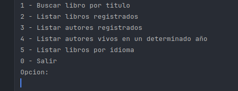
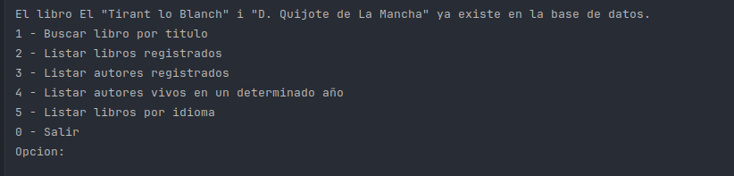
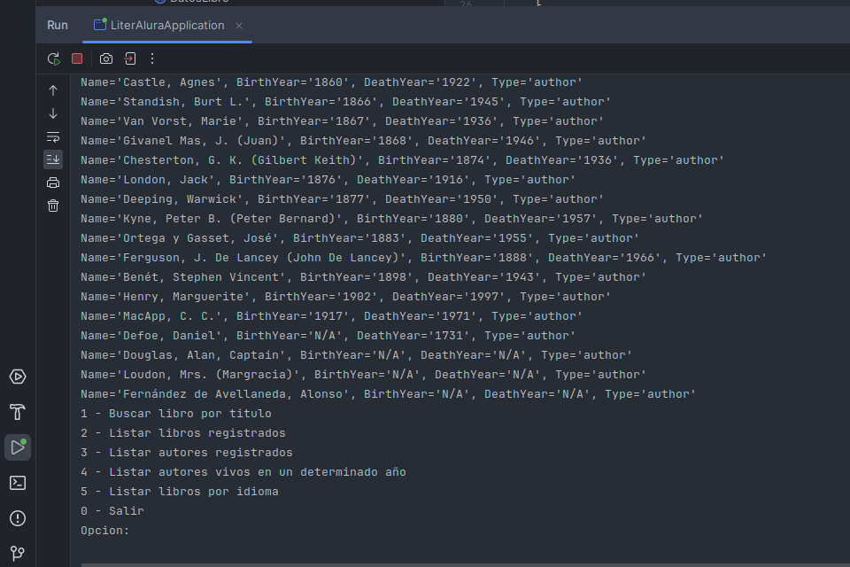
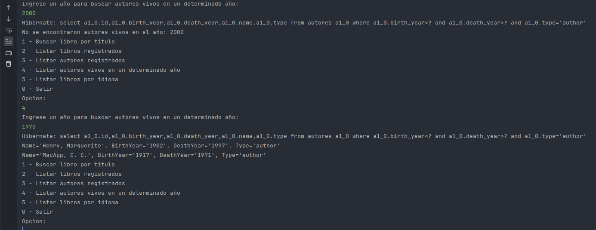
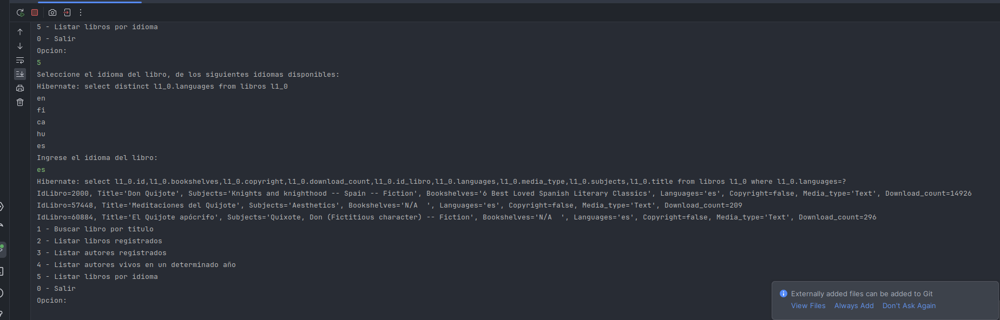
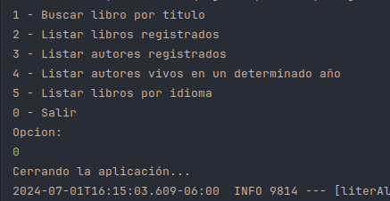

# Challenge Literalura

## Descripción

Este proyecto es una solución al desafío planteado por Literalura. El objetivo del proyecto es desarrollar una aplicación web utilizando Spring Boot y PostgreSQL que permita [describir brevemente el propósito del proyecto].

## Tabla de Contenidos

- [Instalación](#instalación)
- [Configuración de la Base de Datos](#configuración-de-la-base-de-datos)
- [Capturas de Pantalla](#capturas-de-pantalla)


## Instalación

Para instalar y ejecutar este proyecto localmente, sigue estos pasos:

1. Clona el repositorio:
    ```sh
    git clone https://github.com/RobertoEquisde/challenge-literalura.git
    ```

2. Navega al directorio del proyecto:
    ```sh
    cd challenge-literalura
    ```

3. Construye el proyecto usando Maven:
    ```sh
    mvn clean install
    ```

4. Ejecuta la aplicación:
    ```sh
    mvn spring-boot:run
    ```

## Configuración de la Base de Datos

Configura tu base de datos PostgreSQL. Asegúrate de tener una base de datos creada y actualiza el archivo `src/main/resources/application.properties` con las credenciales de tu base de datos:
```properties
spring.datasource.url=jdbc:postgresql://localhost:5432/tu_base_de_datos
spring.datasource.username=tu_usuario
spring.datasource.password=tu_contraseña
spring.jpa.hibernate.ddl-auto=update
spring.jpa.show-sql=true
spring.jpa.properties.hibernate.dialect=org.hibernate.dialect.PostgreSQLDialect
```
## CAPTURA DE PANTALLA








